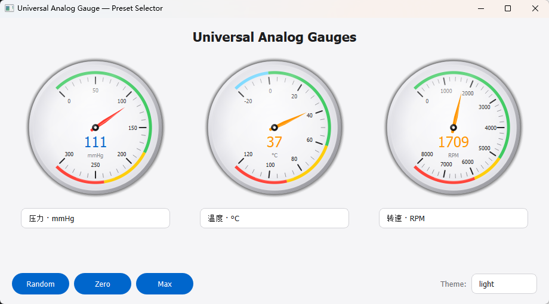
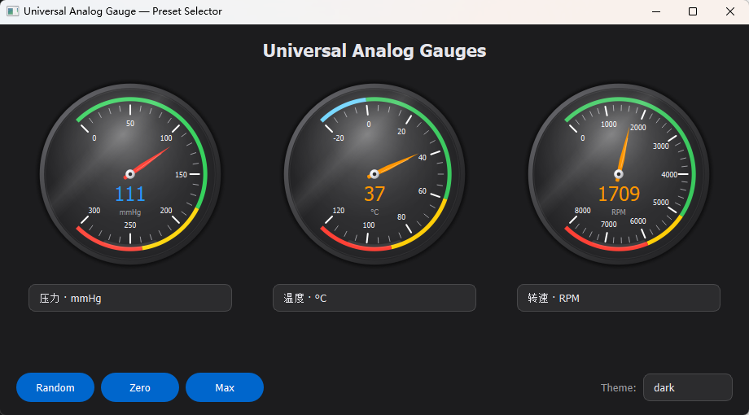
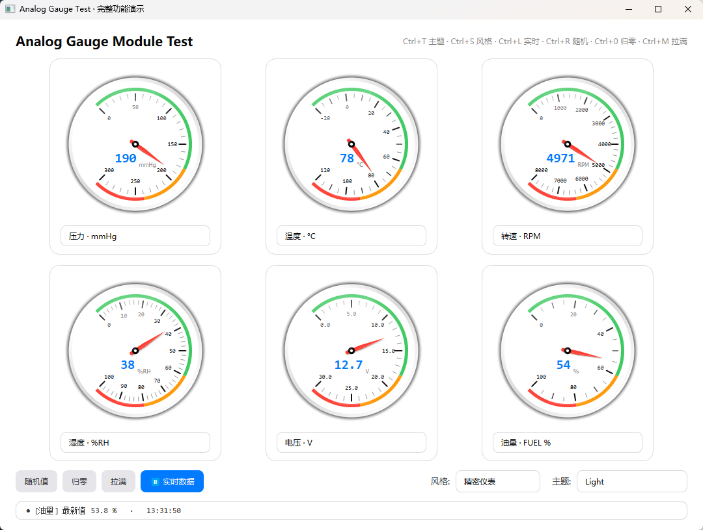
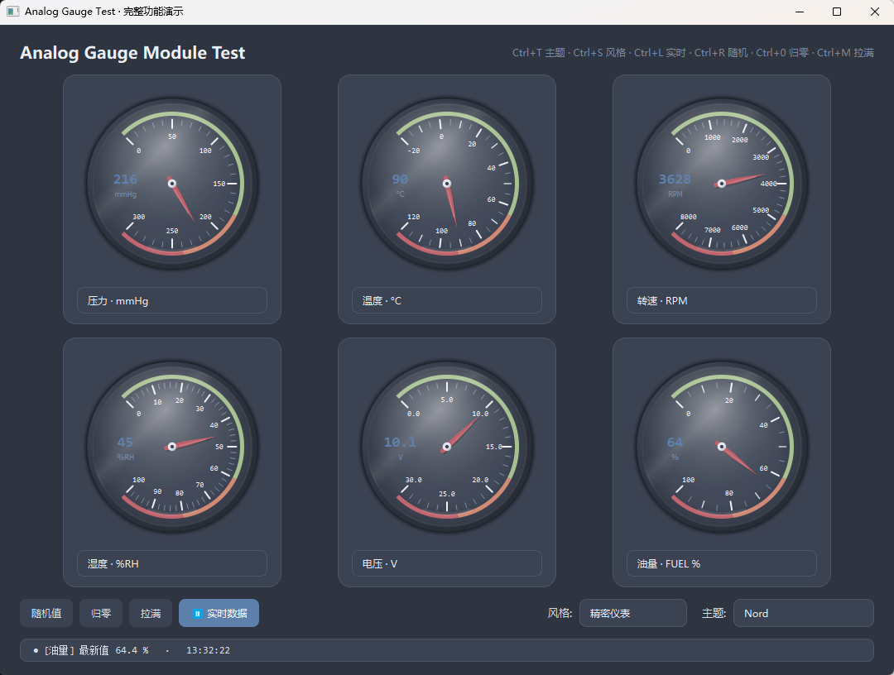
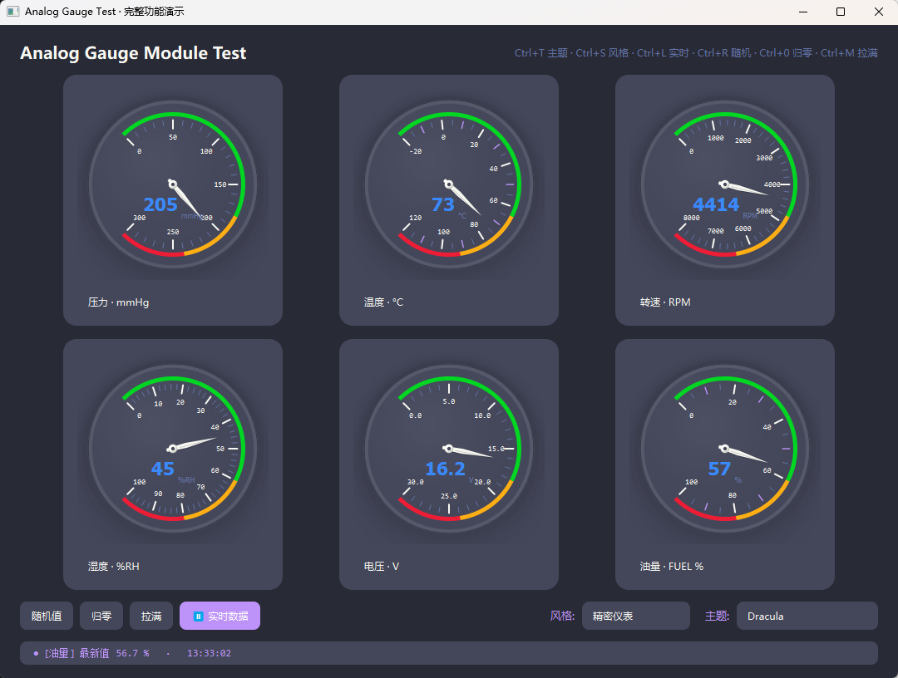
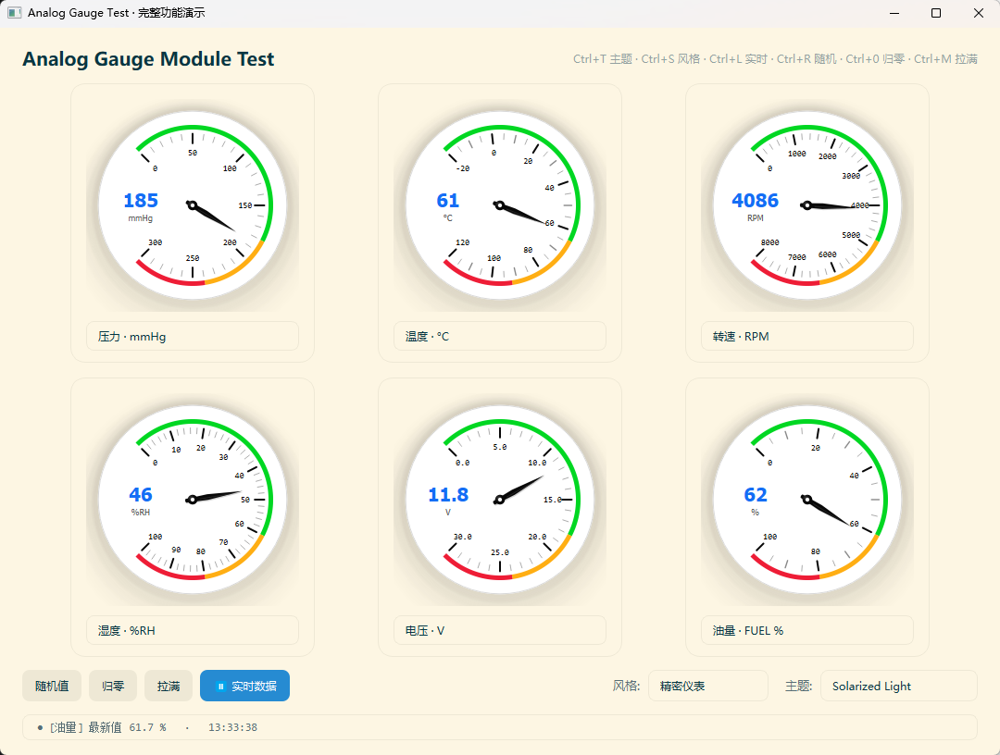

# Analog Gauge — PySide6 通用模拟仪表盘

> 基于 **PySide6 / QPainter** 的通用模拟仪表控件。
> 支持 37 个预设（压力 / 温度 / 转速 / 湿度 / 电压 / 电流 / 功率 /
> 百分比 / 油量 / 速度 / 流量 / 频率 / 光照），5 套主题，3 种风格，
> 平滑指针动画，透明背景，可镶嵌到任意面板。

---

## 目录

- [预览](#预览)
- [版本说明](#版本说明)
- [特性](#特性)
- [环境要求](#环境要求)
- [快速开始](#快速开始)
- [核心用法](#核心用法)
- [API 速查](#api-速查)
- [预设清单](#预设清单)
- [快捷键](#快捷键)
- [主题与色板](#主题与色板)
- [目录结构](#目录结构)
- [常见问题](#常见问题)
- [许可](#许可)

---

## 预览

### V1 · Apple 毛玻璃

| Light | Dark |
|---|---|
| [](1/) | [](1/) |

金属外圈 · 径向渐晕 · 毛玻璃反光 · 扁平指针

### V2 · 瑞士精密仪表

[](2/)

Braun / Dieter Rams 风格 · 锥形指针 + 尾部配重 + 盘面投影 · 三级刻度 · 磨砂盘面

### V2-1 · 瑞士精密 + 值位置可调

[](2-1/)

在 V2 基础上支持 `value_position="left"` —— 值画在表盘内部左侧空白弧区

### V3 · Webflow

[](3/)

白盘 + 1px hairline 描边 · layered drop-shadow · Inter 字体 · 扁平指针

### V3-1 · Webflow + 值位置可调

[](3-1/)

在 V3 基础上支持 `value_position="left"`

---

## 版本说明

仓库包含 5 个版本，每个版本是**独立的可运行项目**，各自包含
`analog_gauge.py` / `test_gauge.py` / `theme.py` 三个文件。

| 目录 | 风格 | 关键特征 | 值位置 |
|---|---|---|---|
| [`1/`](1/) | Apple 毛玻璃 | 金属外圈 · 径向渐晕 · 毛玻璃反光 · 扁平指针 | 中心下方 |
| [`2/`](2/) | 瑞士精密仪表 | Braun 风格 · 锥形指针 + 配重 + 投影 · 三级刻度 · 磨砂盘面 | 中心下方 |
| [`2-1/`](2-1/) | 瑞士精密仪表 v2 | 在 `2/` 基础上支持 `value_position` | **可切换** |
| [`3/`](3/) | Webflow | 白盘 + hairline 描边 · layered shadow · Inter 字体 · 扁平 | 中心下方 |
| [`3-1/`](3-1/) | Webflow v2 | 在 `3/` 基础上支持 `value_position` | **可切换** |

**推荐使用**：`3-1/`（Webflow 风格 + 值可放左侧空白区）。

---

## 特性

- ✅ **37 个预设** —— 一行 `preset="temperature_c"` 搞定单位 / 量程 / 刻度 / 配色
- ✅ **5 套主题** —— light / dark / nord / solarized_light / dracula
- ✅ **3 种风格** —— 精密仪表 / 经典 Apple / 极简
- ✅ **值位置可调** —— below / left / right / center（v2 系列）
- ✅ **平滑指针动画** —— `QPropertyAnimation` + OutCubic 缓动
- ✅ **透明背景** —— 可镶嵌到任意面板（浅色 / 深色 / 渐变 / 图片）
- ✅ **多层阴影** —— inset 镶嵌 / raised 浮起 / none 无
- ✅ **信号驱动** —— `valueChanged` 信号可订阅
- ✅ **主题联动** —— 一行 `ThemeManager.set_theme(...)` 所有表盘自动跟
- ✅ **无第三方依赖** —— 只依赖 PySide6

---

## 环境要求

| 项 | 版本 |
|---|---|
| Python | 3.9+ |
| PySide6 | 6.4+ |

安装：

```bash
pip install PySide6
```

---

## 快速开始

### 1. 克隆仓库

```bash
git clone https://github.com/你的用户名/analog-gauge.git
cd analog-gauge
```

### 2. 进入任意版本目录

```bash
cd 3-1
```

### 3. 运行演示

```bash
python test_gauge.py
```

会弹出 6 个表盘卡片（压力 / 温度 / 转速 / 湿度 / 电压 / 油量），底部
有控制按钮和主题、风格、值位置下拉框。

---

## 核心用法

### 三步使用

```python
from theme import Theme
from analog_gauge import AnalogGauge, ThemeManager, palette_from_theme

# ──────── 步骤 1：注册色板桥接（应用启动时一次）────────
ThemeManager.instance().set_palette_provider(
    lambda name: palette_from_theme(Theme(name))
)

# ──────── 步骤 2：创建表盘（选预设 + 可选覆盖参数）────────
g = AnalogGauge(
    parent,                     # 父组件
    width=240,
    height=240,
    preset="temperature_c",     # 预设名，单位/量程/刻度/配色全自动
    value_position="left",      # 值的位置（v2 系列支持）
)
layout.addWidget(g)

# ──────── 步骤 3：设值 / 切主题 ────────
g.set_value(72.5)               # 带 600ms 缓动动画
g.set_value(72.5, animate=False)  # 立即跳转

ThemeManager.instance().set_theme("nord")   # 一行广播，所有表盘自动跟
```

### 四种创建方式

```python
# ① 只用预设
g = AnalogGauge(parent, 240, 240, preset="pressure_mmhg")

# ② 预设 + 覆盖
g = AnalogGauge(parent, 240, 240,
                preset="pressure_mmhg",
                max_value=500,
                value_position="left")

# ③ 完全自定义（不用预设）
g = AnalogGauge(parent, 240, 240,
                min_value=0, max_value=500,
                unit="kPa",
                major_step=100, minor_step=20,
                accent_color="#FF6B00")

# ④ 手动指定色板（脱离主题系统）
g = AnalogGauge(parent, 240, 240,
                preset="temperature_c",
                auto_follow_theme=False,
                palette={"needle": "#00FF00"})
```

### 监听值变化

```python
def on_value_changed(v):
    print(f"当前值：{v}")

g.valueChanged.connect(on_value_changed)
```

### 运行时改参数

```python
g.set_value_position("left")                       # 改值位置
g.set_unit("kPa")                                  # 改单位
g.set_range(0, 500, major_step=100, minor_step=20) # 改量程
g.merge_palette(needle="#FF00FF")                  # 改单个颜色
```

---

## API 速查

### `AnalogGauge.__init__`

| 参数 | 类型 | 默认 | 说明 |
|---|---|---|---|
| `parent` | QWidget | `None` | 父组件 |
| `width` | int | `340` | 宽度（像素） |
| `height` | int | `340` | 高度（像素） |
| `preset` | str \| None | `None` | 预设名（见下方清单） |
| `config` | GaugeConfig \| None | `None` | 完整配置对象 |
| `palette` | dict \| None | `None` | 手动色板 |
| `auto_follow_theme` | bool | `True` | 是否跟随全局主题 |
| `**kwargs` | — | — | 其余透传给 `GaugeConfig` |

### `GaugeConfig` 字段（按常用度）

| 字段 | 类型 | 默认 | 说明 |
|---|---|---|---|
| `value_position` | str | `"below"` | **值位置**：`below` / `left` / `right` / `center` |
| `min_value` | float | `0.0` | 最小值 |
| `max_value` | float | `100.0` | 最大值 |
| `unit` | str | `""` | 单位文字 |
| `major_step` | float | `20.0` | 主刻度间隔 |
| `minor_step` | float | `5.0` | 次刻度间隔 |
| `title` | str | `""` | 表盘名称（元数据） |
| `accent_color` | str \| None | `None` | 值颜色（None = 主题色） |
| `needle_color` | str \| None | `None` | 指针颜色（None = 主题色） |
| `decimals` | int | `0` | 小数位 |
| `show_numbers` | bool | `True` | 显示刻度数字 |
| `show_unit` | bool | `True` | 显示单位 |
| `show_value` | bool | `True` | 显示当前值 |
| `show_zones` | bool | `True` | 显示语义弧带 |
| `show_glass` | bool | `True` | 显示毛玻璃罩 |
| `transparent` | bool | `True` | 背景透明 |
| `embed_style` | str | `"inset"` | `inset` / `raised` / `none` |
| `zones` | list \| None | `None` | 语义区间 `[(v0, v1, color), ...]` |
| `angle_start` | float | `-135.0` | 起始角 |
| `angle_range` | float | `270.0` | 跨度 |
| `frosted_face` | bool | `True` | 磨砂盘面 |
| `mono_numbers` | bool | `True` | 等宽数字 |
| `needle_shadow` | bool | `True` | 指针投影 |
| `needle_counterweight` | bool | `True` | 指针尾部配重 |
| `three_tier_ticks` | bool | `True` | 三级刻度 |
| `red_marker` | bool | `False` | 盘面红线 |
| `red_marker_value` | float | `0.0` | 红线对应值 |

### 方法

| 方法 | 说明 |
|---|---|
| `set_value(v, animate=True)` | 设值（默认带动画） |
| `get_value()` | 读当前值 |
| `set_unit(unit)` | 改单位 |
| `set_range(min, max, ...)` | 改量程 |
| `set_value_position(pos)` | 改值位置（v2 系列） |
| `set_config(config)` | 整套替换配置 |
| `config()` | 读当前配置 |
| `set_palette(dict)` | 整套替换色板 |
| `merge_palette(**kw)` | 只覆盖几个色板键 |
| `follow_theme(bool)` | 开/关主题跟随 |

### 信号

| 信号 | 说明 |
|---|---|
| `valueChanged(float)` | 值变化时发射 |

### 属性（只读）

| 属性 | 类型 | 说明 |
|---|---|---|
| `min_value` | float | 最小值 |
| `max_value` | float | 最大值 |
| `unit` | str | 单位 |
| `title` | str | 名称 |

---

## 预设清单

共 **37 个预设**，按分类列出。

### 压力

| preset | 单位 | 量程 |
|---|---|---|
| `pressure_mmhg` | mmHg | 0 – 300 |
| `pressure_kpa` | kPa | 0 – 500 |
| `pressure_psi` | PSI | 0 – 150 |
| `pressure_bar` | bar | 0 – 10 |
| `pressure_mpa` | MPa | 0 – 1.0 |

### 温度

| preset | 单位 | 量程 |
|---|---|---|
| `temperature_c` | °C | -20 – 120 |
| `temperature_f` | °F | 0 – 250 |
| `temperature_k` | K | 250 – 400 |

### 转速

| preset | 单位 | 量程 |
|---|---|---|
| `rpm` | RPM | 0 – 8000 |
| `rps` | RPS | 0 – 150 |

### 湿度

| preset | 单位 | 量程 |
|---|---|---|
| `humidity` | %RH | 0 – 100 |

### 电压

| preset | 单位 | 量程 |
|---|---|---|
| `voltage_v` | V | 0 – 30 |
| `voltage_mv` | mV | 0 – 1000 |
| `voltage_kv` | kV | 0 – 10 |

### 电流

| preset | 单位 | 量程 |
|---|---|---|
| `current_a` | A | 0 – 20 |
| `current_ma` | mA | 0 – 500 |

### 功率

| preset | 单位 | 量程 |
|---|---|---|
| `power_w` | W | 0 – 5000 |
| `power_kw` | kW | 0 – 5 |

### 百分比 / 进度

| preset | 单位 | 量程 |
|---|---|---|
| `percentage` | % | 0 – 100 |
| `progress` | % | 0 – 100 |

### 油量 / 电池

| preset | 单位 | 量程 |
|---|---|---|
| `fuel` | % | 0 – 100 |
| `fuel_liter` | L | 0 – 60 |
| `battery` | % | 0 – 100 |

### 速度

| preset | 单位 | 量程 |
|---|---|---|
| `speed_kph` | km/h | 0 – 240 |
| `speed_mph` | mph | 0 – 150 |
| `speed_ms` | m/s | 0 – 50 |

### 流量

| preset | 单位 | 量程 |
|---|---|---|
| `flow_lpm` | L/min | 0 – 100 |
| `flow_m3h` | m³/h | 0 – 50 |

### 频率

| preset | 单位 | 量程 |
|---|---|---|
| `frequency_hz` | Hz | 0 – 100 |
| `frequency_khz` | kHz | 0 – 1000 |

### 光照 / 噪声

| preset | 单位 | 量程 |
|---|---|---|
| `lux` | lx | 0 – 2000 |
| `noise_db` | dB | 0 – 120 |

### 添加自定义预设

在 `analog_gauge.py` 的 `GAUGE_PRESETS` 字典里加一条即可：

```python
GAUGE_PRESETS = {
    # ... 已有 ...
    "torque_nm": dict(unit="N·m", title="TORQUE",
                      min_value=0, max_value=500,
                      major_step=100, minor_step=20),
}
```

之后就能用 `AnalogGauge(parent, preset="torque_nm")`。

---

## 快捷键

`test_gauge.py` 运行时支持以下快捷键：

| 快捷键 | 动作 |
|---|---|
| <kbd>Ctrl</kbd>+<kbd>T</kbd> | 循环切主题 |
| <kbd>Ctrl</kbd>+<kbd>S</kbd> | 循环切风格 |
| <kbd>Ctrl</kbd>+<kbd>V</kbd> | 循环切值位置（v2 系列） |
| <kbd>Ctrl</kbd>+<kbd>L</kbd> | 开/关实时数据模拟 |
| <kbd>Ctrl</kbd>+<kbd>R</kbd> | 随机值 |
| <kbd>Ctrl</kbd>+<kbd>0</kbd> | 归零 |
| <kbd>Ctrl</kbd>+<kbd>M</kbd> | 拉满 |

---

## 主题与色板

### 5 套主题

| 主题名 | 类型 | 说明 |
|---|---|---|
| `light` | 浅色 | Apple 系统色 |
| `dark` | 深色 | Apple 系统色 |
| `nord` | 深色 | Nord 色板 |
| `solarized_light` | 浅色 | Solarized 色板 |
| `dracula` | 深色 | Dracula 色板 |

切换：

```python
ThemeManager.instance().set_theme("nord")
```

### 主题桥接

`analog_gauge.py` 不知道 `theme.py` 的存在。它只接受一个"主题名 → 色板"
的桥接函数，由外部注入：

```python
from theme import Theme
from analog_gauge import ThemeManager, palette_from_theme

ThemeManager.instance().set_palette_provider(
    lambda name: palette_from_theme(Theme(name))
)
```

如果不注册，表盘会用 `DEFAULT_PALETTE`（模块内置的中性浅色）。

### 色板键名

`palette` 字典的键名与含义：

| 键名 | 说明 |
|---|---|
| `bezel_hi` / `bezel_light` / `bezel_dark` / `bezel_lo` | 金属外圈四层渐变（光源左上） |
| `face_inner` / `face_mid` / `face_outer` | 表盘面内→外三层 |
| `tick_minor` / `tick_medium` / `tick_major` | 次 / 中 / 主刻度 |
| `number` | 刻度数字 |
| `label` | 单位文字 |
| `value_text` | 当前值大字 |
| `needle` / `needle_hi` | 指针主体 / 侧面高光 |
| `hub_outer` / `hub_hi` / `hub_inner` | 中心轴三层 |
| `arc_green` / `arc_yellow` / `arc_red` | 语义弧带三色 |
| `glass_a_hi` / `glass_a_mid` / `glass_tint` | 玻璃反光强度（alpha 0–255） |

---

## 目录结构

```
analog-gauge/
├── .gitignore
├── README.md
├── screenshots/            # 可选：放预览图
│   ├── v1_apple.png
│   ├── v2_precision.png
│   ├── v2-1_precision_left.png
│   ├── v3_webflow.png
│   └── v3-1_webflow_left.png
├── 1/                      # Apple 毛玻璃
│   ├── analog_gauge.py
│   ├── test_gauge.py
│   └── theme.py
├── 2/                      # 瑞士精密仪表
│   ├── analog_gauge.py
│   ├── test_gauge.py
│   └── theme.py
├── 2-1/                    # 瑞士精密 + 值位置可调
│   ├── analog_gauge.py
│   ├── test_gauge.py
│   └── theme.py
├── 3/                      # Webflow
│   ├── analog_gauge.py
│   ├── test_gauge.py
│   └── theme.py
└── 3-1/                    # Webflow + 值位置可调
    ├── analog_gauge.py
    ├── test_gauge.py
    └── theme.py
```

---

## 常见问题

### Q1. 表盘全是灰白色，主题切换没反应？

没有注册桥接函数。在应用启动处调一次：

```python
ThemeManager.instance().set_palette_provider(
    lambda name: palette_from_theme(Theme(name))
)
```

### Q2. `value_position="left"` 不生效？

检查三处：

1. 创建表盘时**明确传了** `value_position="left"`
2. 切预设时 `_on_preset_changed` 的 `replace(...)` 里**保留了**
   `value_position=current.value_position`
3. `analog_gauge.py` 的 `_draw_value` 是 **v2 系列**版本（含 `value_position`
   分支）

### Q3. 值撞到刻度数字？

`_draw_value` 里的水平偏移系数太大了。`0.55` 是推荐值，
`0.65` 以上会撞刻度，`0.45` 以下会靠中心太近。

### Q4. 指针不动？

没订阅信号或没设值。检查：

```python
g.set_value(72.5)                      # 设值
g.valueChanged.connect(你的函数)        # 订阅
```

### Q5. 创建报 `ValueError: 未知预设`？

`preset` 名拼错了。检查 `GAUGE_PRESETS` 里的键名，或看
[预设清单](#预设清单)。

### Q6. 表盘背景是黑色的？

父组件背景色透出来了。默认 `transparent=True`，如果想不透明：

```python
g = AnalogGauge(parent, 240, 240,
                preset="...",
                transparent=False)
```

### Q7. 怎么换成别的字体？

改 `analog_gauge.py` 的 `_setup_fonts` 里候选列表：

```python
self._display_family = pick("SF Pro Display", "Inter", "Helvetica Neue")
```

`pick()` 会从前往后找系统里**存在**的第一个字体。

### Q8. 动画太快/太慢？

改 `analog_gauge.py` 的 `__init__`：

```python
self._anim.setDuration(600)                        # ← 毫秒
self._anim.setEasingCurve(QEasingCurve.OutCubic)   # ← 缓动曲线
```

常用缓动：`OutCubic` / `InOutQuad` / `OutBack`。

### Q9. 怎么换值的位置微调？

改 `_draw_value` 里对应分支：

```python
if pos == "left":
    center_x = cx - R * 0.55    # ← 想更靠左改大
    center_y = cy                # ← 想上下移动改这里
    font_scale = 0.90            # ← 想字号更大改这里
```

---

## 许可

MIT License — 随便用、改、分发。

---

## 贡献

欢迎提 Issue 或 PR。

如果这个项目对你有帮助，给个 ⭐ 支持一下。